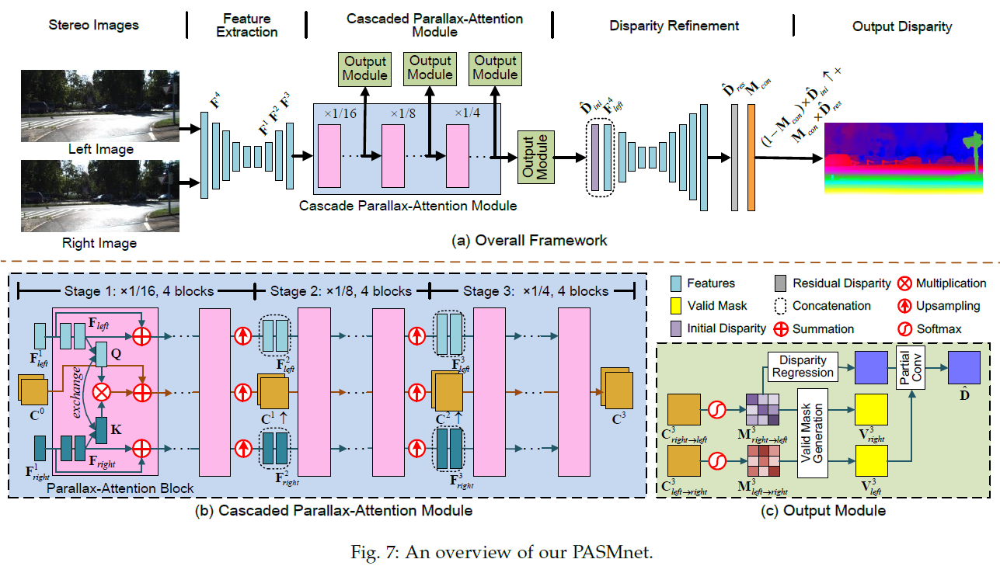
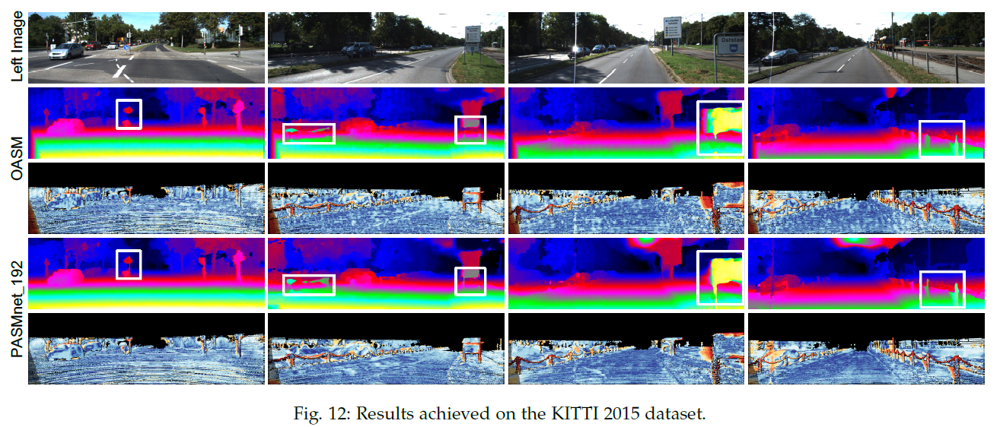
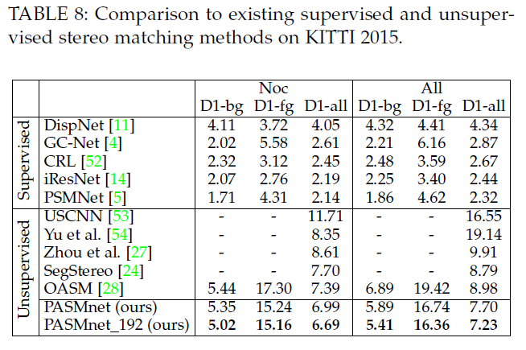
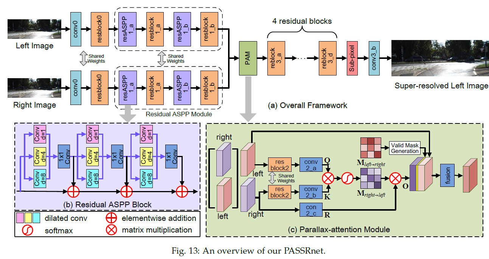
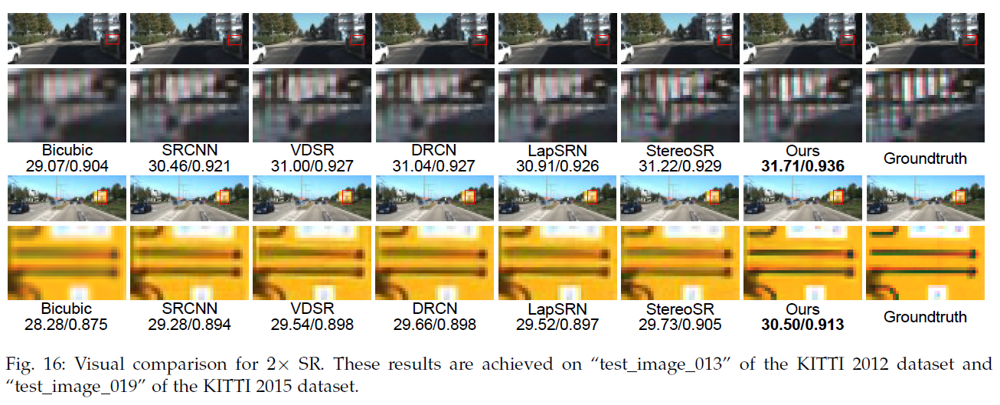

# Parallax-Attention Mechanism (PAM)
Pytorch implementation of "Parallax Attention for Unsupervised Stereo Correspondence Learning"

[[arXiv]]()

## Motivation

## Contributions

## Overview

Figure 1. An illustration of our PAM.

## Applications

### 1. PAM for Unsupervised Stereo Matching (PASMnet)
#### Overview

Figure 1. An overview of our PASMnet.

#### Results

Figure 1. Results achieved on the KITTI 2015 dataset.

Figure 1. Comparison to existing supervised and unsupervised stereo matching methods on KITTI2015.

### 2. PAM for Stereo Image Super-Resolution (PASSRnet)
#### Overview

Figure 1. An overview of our PASSRnet.

#### Results

Figure 1. Visual comparison for 2x SR.

Figure 1. Comparative PSNR/SSIM values achieved on the Middlebury, KITTI 2012 and KITTI 2015 datasets.

## 3. Applications in other works ()
